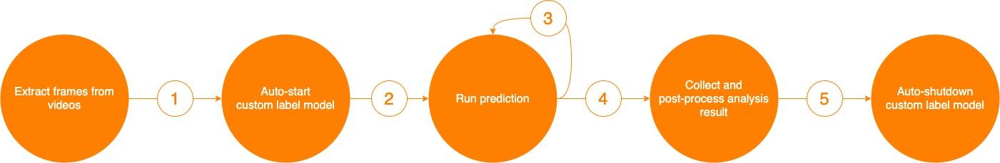

This solution demonstrates an end to end workflow to identifying and detecting specific brand on videos and its audio. 
It consists of two main workflows: Analysis, where the it takes video file (MP4 or MOV) and creates a labeling job for your labelers using Amazon Rekognition service. 
When the labelers complete the labeling job, the web user interface provides visual statistics of how the detected brand (object) distributes across the analyzed videos and its audio.
